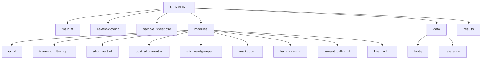

# NF-Pipeline-For-Germline-Variant-Calling

A modular DSL2-based Nextflow pipeline for Germline Variant Calling using:

FastQC
FastP
BWA-MEM
SAMtools
Picard
GATK HaplotypeCaller

Designed for learning production-style bioinformatics workflow development using modular Nextflow architecture.

